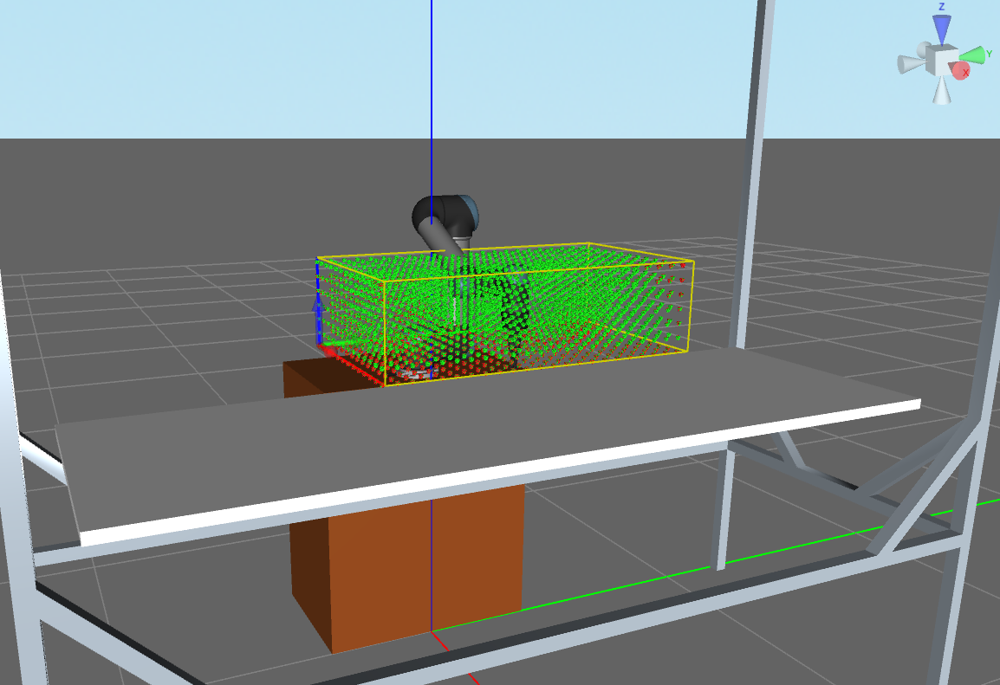

RapidPlan
=========

*RapidPlan* is a roadmap-based planning framework by `Realtime Robotics <https://rtr.ai/>`_ that allows high frequency collision checking and planning using a dedicated FPGA board, the *Motion Planning Accelerator (MPA)*.
The MPA - initialized with a precomputed roadmap - can process point cloud sensor input or other occupancy data to compute all collisions with roadmap edges in parallel.
Solving the planning problem is then a simple shortest path search in the residual roadmap graph.
Depending on the roadmap density these steps can be computed with a frequency of up to 1kHz, making *RapidPlan* excel in online trajectory validation and replanning applications.

Getting Started
---------------

1. Install the `RapidPlan` toolkit and generate roadmap files following the instructions on https://rtr.ai/support
2. Install the ``rtr_moveit`` package following the instructions in the README_
3. Modify_ the planning pipeline to use the RTRPlanner
4. Configure_ the planner and roadmap parameters

The rtr_moveit plugin
---------------------
The ``rtr_moveit`` plugin integrates the *RapidPlan* interfaces into the planning pipeline and supports common ``MotionPlanRequest`` messages.

Goal Constraints
^^^^^^^^^^^^^^^^

Goal states can be defined as arbitrary combinations of Joint-, Position- and Orientation constraints.
Since start and goal states are unlikely to be part of the roadmap the plugin attempts to solve for nearby state candidates and connect the endings afterwards.
This is done by linear interpolation and collision checking using the planning scene in *MoveIt*.
The allowed distance of start and goal state candidates is defined by the parameter ``allowed_joint_distance`` and ``allowed_position_distance``.
The waypoint distance that should be used for collision checking in the planning scene is defined by ``max_waypoint_distance``.
RapidPlan also supports solving for multiple goal states at the same time, the maximum number is defined by ``max_goal_states``.

Occupancy Data
^^^^^^^^^^^^^^

There are two supported types of occupancy data that can be used for collision checking using the MPA.
By default the collision objects in the planning scene are converted into a Voxel grid that is supported by the *RapidPlan* interface.
Alternatively, the plugin can subscribe to a point cloud topic and directly forward current sensor data which naturally is much more time efficient.
Occupancy data type and point cloud topics are configured using the parameters ``occupancy_source`` and ``pcl_topic``.

Visualization
^^^^^^^^^^^^^

The planner data visualization can be configured with following parameters under the ``planner_config`` namespace. All markers are published to the same marker topic which can be defined in parameter ``visualization_marker_topic``. The default topic is "/rapidplan_visualization_markers".
The marker lifetime is configured by setting ``visualization_marker_lifetime`` to the desired duration in seconds. Default is 0.0 which corresponds to infinite lifetime. Enabling / disabling visualization markers is possible by setting ``visualization_enabled`` to ``true`` / ``false``.

.. _Modify:

Setup The Plugin
----------------

You need a working *MoveIt* setup which we reference from now on with ``<your_moveit_setup>``.
If you don't have a setup you can also use `Franka Emika's Panda Config <https://github.com/ros-planning/panda_moveit_config>`_.
Make sure to replace all references with the actual package name.

Create a file ``<your_moveit_setup>/launch/rtr_planning_pipeline.launch.xml`` with the following content::

  <launch>
    <!-- RapidPlan Plugin for MoveIt -->
    <arg name="planning_plugin" value="rtr_moveit/RTRPlanner" />
  
    <!-- The request adapters (plugins) used when planning with RapidPlan. ORDER MATTERS -->
    <arg name="planning_adapters" value="default_planner_request_adapters/AddTimeParameterization
  				       default_planner_request_adapters/FixWorkspaceBounds
  				       default_planner_request_adapters/FixStartStateBounds
  				       default_planner_request_adapters/FixStartStateCollision
  				       default_planner_request_adapters/FixStartStatePathConstraints" />
  
    <arg name="start_state_max_bounds_error" value="0.1" />
    <param name="planning_plugin" value="$(arg planning_plugin)" />
    <param name="request_adapters" value="$(arg planning_adapters)" />
    <param name="start_state_max_bounds_error" value="$(arg start_state_max_bounds_error)" />
  
    <!-- Load the planner params -->
    <rosparam command="load" file="$(find <your_moveit_setup>)/config/rtr_planning.yaml"/>
  </launch>

Change the ``move_group`` parameter ``pipeline`` in your ``move_group.launch`` to ``rtr`` like below so that the new pipeline launch file is used::

  ...

  <!-- Planning Functionality -->
  <include ns="move_group" file="$(find <your_moveit_setup>)/launch/planning_pipeline.launch.xml">
    <arg name="pipeline" value="rtr" />
  </include>

  ...

Create the file ``<your_moveit_setup>/config/rtr_planning.yaml`` and configure roadmap and planner parameters.
You can use this rtr_planning.yaml_ template and follow the instructions below for adding your own generated roadmaps.

Generate Roadmaps with Panda
^^^^^^^^^^^^^^^^^^^^^^^^^^^^^^

Due to the joint redundancy of the Panda there are some points that need to be considered when generating roadmaps.
Roadmaps can be generated for the full robot ``panda_arm_hand.urdf.xacro`` or only the arm without gripper ``panda_arm.urdf.xacro``.
Start with converting the corresponding XACRO file to URDF by running::

    rosrun xacro xacro --inorder panda_arm_hand.urdf.xacro > panda_arm_hand.urdf

When using the ``panda_arm_hand.urdf.xacro`` the finger joint types need to be set to 'fixed' or otherwise the rtr-toolkit won't be able to load the urdf.
Follow the instructions on https://rtr.ai/support to configure voxel region and roadmap states.
When creating the new project set the "Kinematic Chain End" to ``panda_link8``.

Keep in mind that the roadmap must be reachable when launching the robot.
For starters simply set the origin pose to the same joint configuration as the 'ready' state from the file ``<your_moveit_setup>/config/panda_arm_hand.srdf.xacro``.
Alternatively, you can also add your desired origin pose to the SRDF file and use it as start state by modifying the `initial_pose` parameter inside ``<your_moveit_setup>/config/fake_controllers.yaml``.

After the .og file is generated, create a subdirectory ``<your_moveit_setup>/roadmaps`` and copy the file into it.
Specify the roadmap to use for the planning group ``panda_arm`` inside ``rtr_planning.yaml`` like below::

    default:
      roadmaps_package: panda_moveit_config
      roadmaps_directory: roadmaps
    panda_arm:
      default: <your_og_file>

More instructions on how to store and specify roadmap files can be found in the "Roadmap Configuration" section.

Now you can launch the Panda demo::

    roslaunch panda_moveit_config demo.launch

Open the MoveIt MotionPlanning panel in RViz and select the planning group 'panda_arm' in the PlanningRequest menu.
You should be able to select your named roadmap in the dropdown from within the MotionPlanning context view.
Try dragging the end effector around and run plans as usual.
If too many planning attempts fail the reason is probably that no roadmap state is close enough to the goal state.
Simply increase the parameter ``allowed_joint_distance`` or try a bigger roadmap with higher density.
More descriptions about available parameters can be found in the next section.

Planner Parameters
^^^^^^^^^^^^^^^^^^

Planner parameters are defined under the namespace ``move_group/planner_config``.

**rapidplan_interface_enabled** (bool) - Allows disabling collision checks using the MPA for testing.

**allowed_joint_distance** (float) - Absolute joint distance tolerance for start and goal states.

**allowed_position_distance** (float) -  *(not implemented as of Feb 2019)* Absolute tool position tolerance for start and goal states in meter.

**allowed_orientation_distance** (float) - *(not implemented as of Feb 2019)* Absolute tool orientation tolerance for start and goal states in rad.

**max_waypoint_distance** (float) - Absolute joint distance for collision checking in the planning scene when connecting start and goal states.

**max_goal_states** (int) - The maximum number of roadmap states to sample from goal constraints for planning.

**occupancy_source** (string, default= `"PLANNING_SCENE"`) - Sets the type of occupancy data to use, either `"PLANNING_SCENE"` or `"POINT_CLOUD"`.

**pcl_topic** (string) - If ``occupancy_source`` is set to `"POINT_CLOUD"` this is the ROS topic to subscribe for sensor data.

**visualization_enabled** (bool, default=false) - Toggles visualization of roadmap and solutions in RViz.

**visualization_marker_topic** (string, default=/rapidplan_visualization_markers) - The visualization marker topic.

**visualization_marker_lifetime** (float, default=0.0) - The marker lifetime in seconds. 0.0 equals infinite lifetime.

.. _Configure:

Roadmap Configuration
^^^^^^^^^^^^^^^^^^^^^

A roadmap is represented by a single \*.og file and a name identifier.
The roadmap file path is composed by the package path, the directory in the package and the file name.
Default package and directory can be set using the parameters ``default/roadmaps_package`` and ``default/roadmaps_directory``.
The default file name is the name of the roadmap.

Each group should have a default roadmap name specified under ``group/default_roadmap``.
Further roadmaps can be added as a list under ``group/roadmaps``.

Roadmaps where the files should not be resolved from the defaults can be configured under ``roadmaps``.
Here each roadmap can have specific entries for ``filename``, ``package``, or ``directory`` that overwrite the defaults.
The same pattern can be used when adding additional parameters later.
This is also useful for creating aliases of the same roadmap with different configurations.

A valid roadmap configuration inside the ``rtr_planning.yaml`` config has the following pattern::

  roadmaps:
    roadmap_1:
      filename: another_filename
      directory: directory_B
    roadmap_2:
      package: package_B
  
  default:
    roadmaps_package: package_A
    roadmaps_directory: directory_A
  
  group:
    default_roadmap: roadmap_1
    roadmaps:
    - roadmap_2
    - roadmap_3

The parameter lookup iterates over all roadmap names of each group and loads all roadmap files that can be found.
This makes the use of either ``default`` or ``roadmaps`` optional.
Groups without any valid roadmaps are not available for planning.
If no group with a valid roadmap was found the plugin initialization fails with an error.
The example above would resolve to the following roadmap paths: 

  - roadmap_1: <package_A>/directory_B/another_filename.og
  - roadmap_2: <package_B>/directory_A/roadmap_2.og
  - roadmap_3: <package_A>/directory_A/roadmap_3.og

.. _rtr_planning.yaml:  https://github.com/RealtimeRobotics/rtr_moveit/blob/master/rtr_moveit_tutorial/rtr_planning.yaml
.. _README: https://github.com/RealtimeRobotics/rtr_moveit/blob/master/README.md
